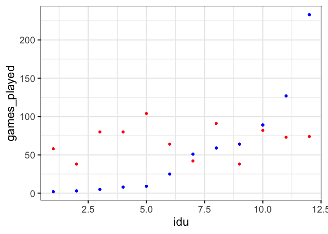
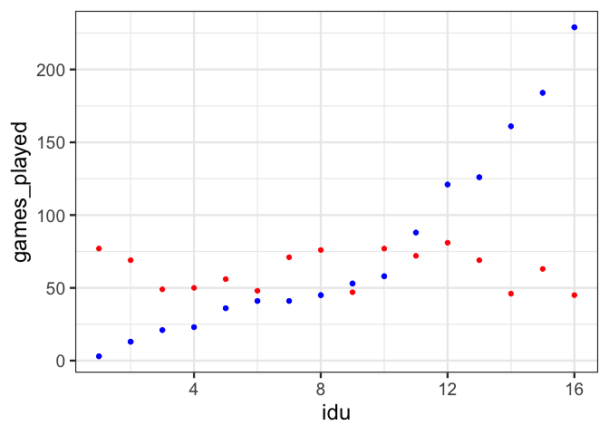
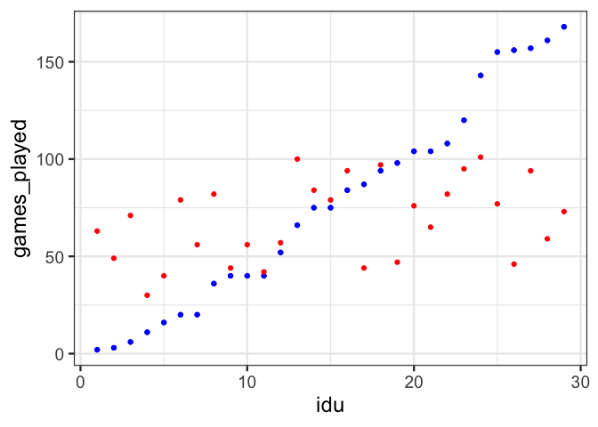
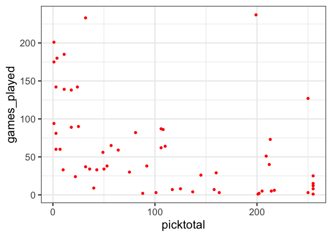

Predicting draft results and NFL success based on NFL Scouting combine
data
================

## Abstract

The NFL combine measures various physical traits of prospective NFL
players in order to help guide teams’ choices in the upcoming NFL draft.
We use K-nearest neighbor models to determine to what extent NFL combine
results can be used to predict both draft postition and NFL success. We
were able to design models that consistently outperform the null model
in predicting draft position, especially at the Quarterback and Running
back positions. However, our models for predicting NFL success in the
way of games played make predictions that have almost no correlation
with actual results. We conclude that, due to a shown correlation
between draft position and nfl success and a correlation between
performance in certain combine events and draft position, that it is
worth exploring more sophisticated models in making these predictions.

## Introduction

The NFL Scouting Combine is an annual event where prospective NFL
players from around the nation show off their physical skills in various
events in order to increase their draft position/chance of being
drafted. The week-long event is heavily attended by both the media and
NFL personnel, and is the subject of much speculation. Every year
players see their draft prospects skyrocket or plummet based on their
performance. However, it is becoming an increasingly popular opinion
that too much weight is placed on Combine results as they do not
accurately reflect real football situations. For instance, players will
almost never sprint 40 yards in a straight line in an NFL game. Our goal
is to determine to what extent it is possible to build statistcal models
that predict the draft position and overall carreer success of players
based solely on their combine data. It’s obvious why a model that
predicts player success would be useful, coaches and general managers
can use this information to decide who to pick. The application of a
draft position predictor is less obvious. However, if it is accurate
enough, general managers could use this information to guide their draft
strategy by letting them know which players are likely to be available
at which rounds.

## Methods

### The Data

Combine results were collected from nflsavant.com. The data includes
basic measurements such as the height and weight of each player, along
with the results of 8 different combine events explained below:

#### Forty Yard Dash

A sprint covering 40 yards. Used to evaluate acceleration and speed.

#### Twenty Yard Shuttle

The athlete starts at the center cone of three cones, each a distance of
5 yards apart. The athlete then pushes off their dominant leg in the
opposite direction for 5 yards and touches the line. After covering this
distance and touching the line as quickly as possible, the athlete must
reverse and go 10 yards in the opposite direction and again touch the
line. Finally, they reverse direction again, ending the drill at the
starting point after traveling another 5 yards. Used to evaluate
quickness and change of direction ability.

#### Three Cone Drill

Three cones are placed five yards apart from each other forming a right
angle. The athlete starts with one hand down on the ground and runs to
the middle cone and touches it. The athlete then reverses direction back
to the starting cone and touches it. The athlete reverses direction
again but this time runs around the outside of the middle cone on the
way to the far cone running around it in figure eight fashion on his way
back around the outside of the middle cornering cone.

#### Standing vertical Jump

A measure of an athletes standing vertical jump. It is measured based on
the height the player is able to reach with his fingertips. It is used
to evaluate leg strength and explosiveness.

#### Standing Broad Jump

This drill measures one’s lower body strength. The athlete positions
himself behind the marked line, then once he is set, jumps horizontally
off from both feet. The distance jumped is measured from the start line
and to the point of heel contact or to the nearest body part.

#### 225 bench press

This is used to measure upper body strength. The athlete completes as
many bench reps as possible.

### The Models

#### Draft position

We created 4 models for predicting draft position. One for each
offensive position group: Quarterbacks, Running backs, Wide Receivers,
and Offensive Linemen. We decided to use a K-nearest neighbors model,
which will use the results of the K most similar players to predict the
draft position of a given player. We decided to use this model because
the interactions between combine events may not be obvious and K nearest
neighbors models are great at automatically taking interactions into
account.

There are many missing values for combine event results. We decided to
not consider any events where the majority of players in a given
position group did not participate in. For example, in the quarterback
model, we did not include the 3 cone drill because the vast majority of
QB’s did not participate, but we did include the 3 cone drill in the
models for the other three position groups. We figure that players are
naturally going decide to participate in the events considered most
important to their position, so this is a good natural filter for which
events to include.

We trained the models with overall pick number as the target variable.
To evaluate the success of the models, we divided the draft into 5 equal
sized groups(i.e. picks 1 - 51 were group 1, picks 52 - 103 group 2,
etc), and looked at the rate at which each model predicted the correct
group for a given player. To make theses results meaningful, we add a
“null model” that simply picks a random number between 1 and 5 for
each player.

#### NFL Success

Our methods for predicting NFL success will be much the same as for
predicting draft position, except each model will be trained to predict
total games played throughout their career as a target variable. We
decided that ultimately what makes a successful draft pick is how much
they are able to actually play and contribute to the team. Another
benefit to using games played as a target variable is we can use it for
all 4 models, whereas we would otherwise have to choose a different
statistic for each model due to the huge difference in what consitutes
success at each position.

For these models, we only considered players that had already finished
their career. We did this because very successful draft picks that are
in the early stages of their career will be seen by the model as
unsuccessful picks because they have not had the chance to play a high
number of games.

## Results

We evaluated the performance of each model by comparing the percentage
of correct guesses each of our models(V1) made compared to the null
model(V2). These values are averaged over 100 runs to reduce variance.

    ## [1] "Quarterbacks:"

    ##        V1        V2 
    ## 0.2857143 0.2038095

    ## [1] "Wide Receivers:"

    ##        V1        V2 
    ## 0.2250000 0.2016667

    ## [1] "Running Backs:"

    ##        V1        V2 
    ## 0.2675862 0.1982759

    ## [1] "Offensive Linemen:"

    ##        V1        V2 
    ## 0.2216364 0.2038182

Here the models for quarterbacks and running backs consistently perform
much better than the models for wide receivers and offensive linemen.
However, none of the models perform significantly better than the null
model.

Next we will plot the games played predictions made by our models
compared to the actual games played for a sample test set. The red dots
represent our models’ predictions and the blue dots represent the actual
number of games played.

#### Quarterbacks

<!-- -->

#### Wide Receivers

<!-- -->

#### Runningbacks

<!-- -->

#### Offensive Linemen

<!-- -->

## Conclusion

It’s not surprising that our draft position models were not able to
significantly outperform their respective null models. It makes sense
that a lot more goes into the decision to draft a player than raw
physical stats when most of these players have hours and hours of actual
game footage. NFL teams already have a general idea of how they rank
prospects before the combine begins, so it’s possible that it would make
more sense to model how combine results change the perceived value of a
player. However, this would be difficult as NFL teams do not make their
pre-combine rankings of players known.

What is surprising is that of the four position groups, quarterbacks
were the second easiest to predict the draft position of. Quarterback is
generally considered one of the more cerebral positions on the field,
and consequently they are perceived as not relying on their physical
ability as much as other positions. It is possible that quarterbacks
tend to be concentrated in the first few rounds due to being one of the
highest valued positions, and our model is able to learn this.

Unsurpisingly, the games started models do even worse. The most obvious
reason for this is that there is an extra layer between The combine and
a player’s NFL career. The models do best at predicting players that
play around 0-75 games or so. This is likely due to the fact that as a
player’s number of games played goes up, they are increasingly likely to
stop playing due to factors not related to ability such as injuries and
simply deciding to retire. It’s also true that games played is not a
perfect measure of career success. Two players that play the same number
of games can have much different performances in said games that our
model cannot account for.

A possible flaw in both models is that the prototypical build for each
position has likely changed over time. For example, certain positions
like quarterback have become faster and more athletic in recent years.
Meaning combine data from the early years of our data set will be less
useful in predicting the results of more recent drafts.

Figures 1-3 in the appendix show that there exists a correlation between
games played and draft position, and also a correlation between
performance in a number of combine events and draft position. This
suggests that it is worth researching further if more sophisticated
models can be used to more accurately predict these draft position and
NFL success based on combine data.

## Appendix

### Figure 1: Draft position plotted against games started by position

Top left: QB, Top right: WR, Bottom Left: RB, Bottom Right: OL

### Figure 2: 40 yard dash plotted against draft position

Left: Wide Receiver, Right: Runningback

### Figure 3: Offensive line Bench Press plotted against draft position

